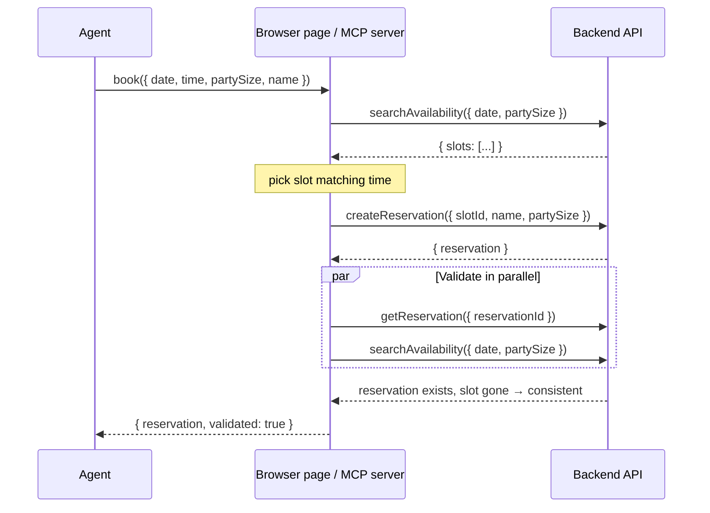
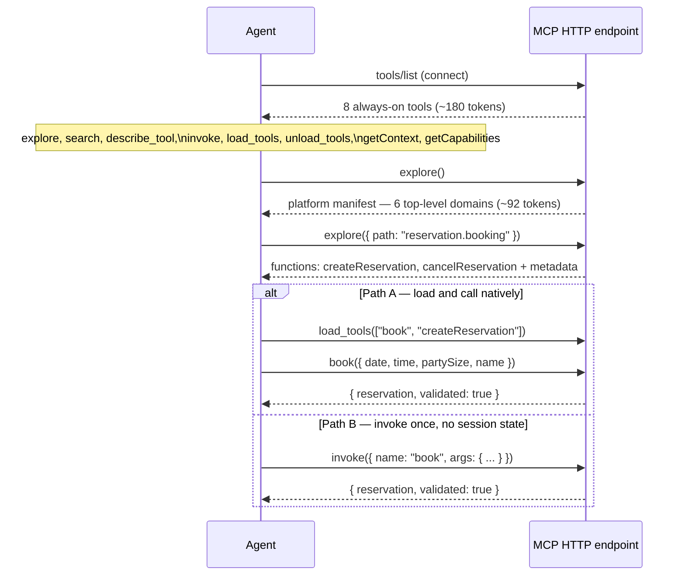
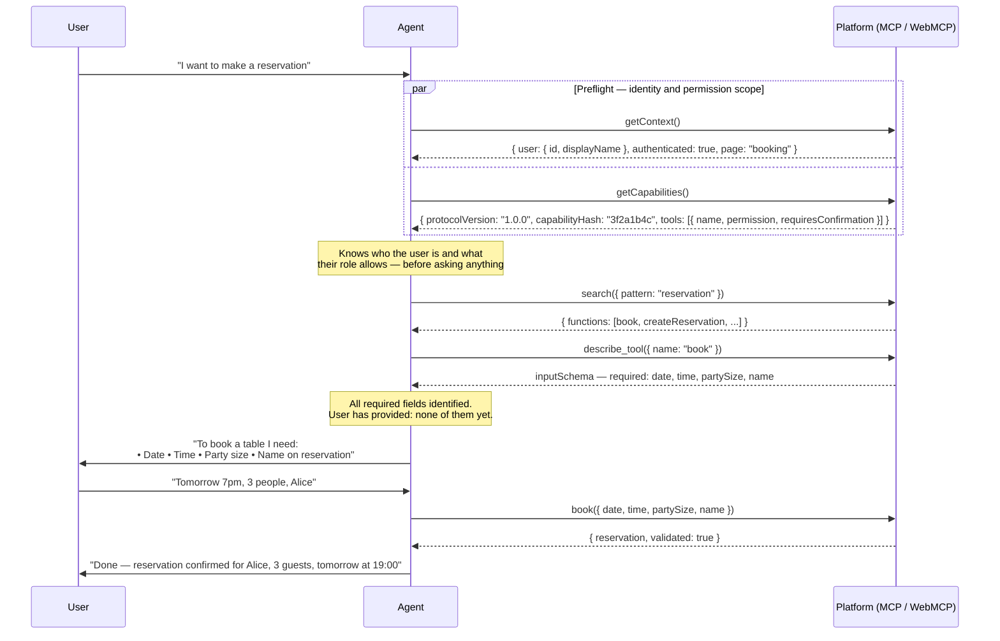

# WebMCP / AgentBridge

**Business logic that lives in the browser page, exposed to agents as structured tools through the WebMCP standard.**

WebMCP (`document.modelContext`) is a browser-native API that lets a page register callable tools for AI agents — the same way it registers event listeners for users. **NavWebMcp** is the protocol layered on top: progressive tool disclosure, RBAC, and composite operations. **AgentBridge** is this repo's reference implementation of NavWebMcp: it adds RBAC, progressive tool disclosure, audit logging, a polyfill for today's browsers, and an MCP Streamable HTTP surface so external agents (Claude Code, Claude Desktop, MCP Inspector) can connect with no browser required. A [protocol-level agent skill](skills/navwebmcp-agent/SKILL.md) ships alongside it, for any agent talking to any NavWebMcp server.

Built on [Next.js](https://nextjs.org) and the [Model Context Protocol](https://modelcontextprotocol.io).

---

## Benchmarks — efficiency, cost, effectiveness

All numbers below are measured, not estimated: real MCP Streamable HTTP transport, a real headless browser for the WebMCP and UI-automation lanes, `n=5` runs, production build. Reproduce with the commands at the end of this section. Token model: 1 token ≈ 4 characters (`chars/4`).

### Composite calls vs. multi-call orchestration — booking flow

| Lane | Transport | Calls/booking | Avg latency | Tokens/booking* |
|---|---|---|---|---|
| Raw MCP (`load_tools` + native) | Real MCP HTTP | 3 | 49 ms | 366 |
| Raw MCP (`invoke`, no load step) | Real MCP HTTP | 3 | 59 ms | 418 |
| **`book()` composite** | Real MCP HTTP | **1** | **16 ms** | **91** |
| **`book()` composite** | Real browser (WebMCP) | **1** | **39 ms** | **75** |
| Playwright UI automation | Real browser, 7 clicks | 1 user action | 422 ms | 5,710† |

\* input + output tokens, excludes the one-time tool-schema cost of `load_tools`. † cumulative accessibility-tree tokens an agent would need to *read* the page before each click — not directly comparable to the other rows, but that's the point: it's the cost nothing else on this list pays.

**Composite call vs. raw multi-call: −78 to −80% tokens, per booking, on both surfaces.** Latency drops −67 to −73% over MCP; the WebMCP composite is a smaller −20 to −34% win since it's still driven from inside a real browser page. All lanes succeeded 5/5 — the savings cost nothing in reliability.

### It compounds with scope

| Scenario | Raw calls | Composite calls | Token saving | Latency saving |
|---|---|---|---|---|
| `book` — 3-op booking | 3 | 1 | −75% | −67% |
| `journey` — book + seat a guest (2 real actions, one session) | 6 | 2 | −80% | −65% |
| `vip` — 7-op chain across CRM + front desk | 7 | 1 | −68% | −84% |

The `journey` flow's Playwright lane (one continuous UI session doing both actions) costs **818 ms** and **11,292 cumulative tokens** of DOM reads — versus **35 ms** and **154 tokens** for the two composite calls. The `vip` flow has no Playwright row at all: CRM has no UI in this app, so there's nothing to click — a real limit of browser automation that composite calls don't have.

### Testing the architecture, not just the agent

A separate question from the above: how long does it take to *test* the business logic itself? `runOne()` (`lib/operations/dispatch.ts`) called in-process — zero HTTP, zero MCP, zero browser — versus a Playwright script driving the same scenario through the UI:

| Scenario | Function call | Playwright | Speedup |
|---|---|---|---|
| `book()` | 0.89 ms | 388 ms | **437×** |
| `seatGuest()` | 0.35 ms | 459 ms | **1,314×** |
| `hostVipGuest()` | 0.18 ms | — (no UI exists) | — |

Same Zod validation, same RBAC, same handler code as every other lane — no transport at all. This is the argument for testing the Operation layer directly instead of only through end-to-end browser tests.

### Reproduce

```bash
npm run build && npm start          # separate terminal — both scripts need a running server

node scripts/bench.mjs --n=5        # agent-transport comparison: booking, checkin, journey, vip
node scripts/speedbase.mjs --n=5    # test-execution speed: function call vs Playwright

node scripts/bench.mjs --flow=checkin --headed --slowmo=250 --demo   # watch a lane live
```

Both write their results to `docs/*-data.js` / `docs/*-results.json`. Open `docs/presentation.html` in a browser for the full slide deck with live numbers.

---

## The core idea

Every existing approach makes the **agent** orchestrate multiple calls:

```
Agent → searchAvailability()   →  parse slot list, extract slotId
Agent → createReservation()    →  parse result, decide to validate
Agent → getReservation()       →  finally confirm success
```

Three round-trips. Three reasoning gaps. Growing context. The agent must understand your domain well enough to sequence the calls correctly — that knowledge lives in the prompt, re-processed on every call, and can hallucinate.

**AgentBridge flips this.** Business logic lives in the frontend as a composite function registered into `document.modelContext`. The agent calls one tool and gets a validated result:

```
Agent → book({ date, time, partySize, name })  →  { reservation, validated: true }
```

One call. Zero reasoning gaps. The orchestration runs invisibly — in the browser (session-cookie auth) or in-process on the server (bearer token auth).

---

## Protocol flow

### 1. Composite tool — `book()` as a single agent call



The agent sees none of steps 1–3. If the post-condition check fails (reservation missing or slot still open), the orchestration rolls back via `cancelReservation` and returns a typed error. Source: `lib/core/book.ts`. `seatGuest` (`lib/core/seatGuest.ts`) and `hostVipGuest` (`lib/core/hostVipGuest.ts`) follow the identical pattern for front-desk seating and a 7-step CRM+front-desk chain, respectively.

### 2. One registry, two surfaces

```mermaid
flowchart TD
    REG["lib/operations/\nOperation registry\n(48 business ops + 8 meta)"]

    REG -->|lib/adapters/mcp.ts| MCP["MCP Streamable HTTP\napp/api/[transport]/\nBearer token · 8h TTL"]
    REG -->|lib/adapters/webmcp.ts| WEB["In-page WebMCP\ndocument.modelContext\nSession cookie"]

    MCP --> EXT["External agents\nClaude Code · Claude Desktop\nMCP Inspector"]
    WEB --> BRW["Browser agents\nin-page JS · console"]

    subgraph book_surfaces["book() — same orchestration, different caller injection"]
        OP["lib/core/book.ts\nbookOrchestration(input, call)"]
        OP -->|makeDispatch(ctx)\nin-process handlers| MCP
        OP -->|serverCall → fetch('/api/call')\nbrowser HTTP| WEB
    end
```

Both surfaces expose `book()`, `seatGuest()`, and `hostVipGuest()` (the latter two gated to `support`/`admin`). The only difference is the `call` function injected into the `lib/core/*.ts` orchestration:

| Surface | `call` implementation | Auth |
|---|---|---|
| In-page WebMCP | `serverCall` → `fetch("/api/call")` | Session cookie |
| MCP Streamable HTTP | `makeDispatch(ctx)` → handler in-process | Bearer token |

### 3. Progressive tool disclosure — how agents discover operations



On connection only the 8 always-on navigation tools appear — about **180 tokens**. If all 56 operations were loaded at connect it would cost proportionally more on every single request; with progressive disclosure that cost stays flat regardless of registry size — see the deck's slide 6 for measured numbers at 7 and 50 operations.

### 4. Gather first, ask once — the full conversation pattern

The protocol is designed so the agent does all its research before saying a word to the user. The user gets one question, provides all the information in one reply, and the operation executes.



`getContext` tells the agent who the user is and what page they're on. `getCapabilities` gives the role-scoped tool catalogue — name, permission level, and whether confirmation is required — without full input schemas, plus `protocolVersion` (the semver of the protocol contract, identical for every role) and `capabilityHash` (an 8-hex content hash of that role's tool set, used to cache-bust when the registry drifts). Together they answer: *who is this person and what are they allowed to do?* The agent has this before the first `explore` call, so it can skip irrelevant domains, identify every required parameter by inspecting schemas, and surface a single consolidated question rather than a sequential Q&A.

This behaviour is enforced by the agent instructions delivered at connect time (MCP `initialize.instructions` / `document.modelContext.instructions`). See `lib/agent-instructions.ts`.

---

## The steps, explained

### Connect + preflight

When an agent connects to the MCP HTTP endpoint, `tools/list` returns **only the 8 always-on tools**:

| Tool | Role | What it returns |
|---|---|---|
| `getContext` | **Preflight** | Who the user is: `{ page, authenticated, locale, user: { id, displayName } }` |
| `getCapabilities` | **Preflight** | What their role allows: `{ protocolVersion, capabilityHash, tools: [{ name, permission, requiresConfirmation }] }` |
| `explore` | Discovery | Module tree navigation by dot-path |
| `search` | Discovery | Find operations by Linux-style glob |
| `describe_tool` | Discovery | Full JSON Schema for named operation(s) |
| `invoke` | Execution | Call any operation, single or batch, without loading |
| `load_tools` | Session | Promote operations to native MCP tools for this session |
| `unload_tools` | Session | Remove promoted tools from `tools/list` |

**The agent should call `getContext` and `getCapabilities` in parallel immediately after connecting.** This is the preflight:

- `getContext` answers *who is this user?* — identity, current page, locale. The agent can personalise its behaviour and skip domains the user won't need.
- `getCapabilities` answers *what is this role allowed to do?* — the full tool list scoped to the caller's role, including which operations require explicit confirmation. The agent can rule out unauthorised tools without fetching their schemas first.

With this information in hand before any `explore` call, the agent can identify every relevant operation, fetch only the schemas it needs, aggregate all required parameters in one pass, and ask the user a **single consolidated question** rather than sequential one-at-a-time prompts.

### Discover

**`explore()` — tree navigation by path you already know:**

```json
// Step 1: understand the platform (no args)
// → { app: "AgentBridge Hospitality", modules: [reservation, crm, frontoffice, tasks, housekeeping, finance] }
// Cost: ~92 tokens

// Step 2: inspect a domain
explore({ "path": "reservation" })
// → { submodules: [reservation.availability, reservation.booking, reservation.search, reservation.admin] }

// Step 3: inspect a leaf module
explore({ "path": "reservation.booking" })
// → { functions: [{ name: "createReservation", permission: "write" }, { name: "cancelReservation", requiresConfirmation: true }] }

// Wildcard: entire subtree in one call
explore({ "path": "reservation.*" })

// Multi-path: two modules in one round-trip
explore({ "path": ["reservation.booking", "crm.guests"] })
```

**`search()` — discovery when you don't know the path:**

Patterns are Linux-style globs matched against `module/path/functionName` strings. A bare keyword with no metacharacters is auto-expanded to `**/*keyword*`.

```json
search({ "pattern": "**/*reservation*" })
// → { functions: [createReservation, cancelReservation, ...], modules: [...] }

search({ "pattern": "reservation" })
// identical — bare keyword auto-expanded

search({ "pattern": "*refund*" })
// → { functions: [{ name: "issueRefund", module: "finance.adjustments" }] }
```

Search is **role-scoped**: a `customer` token running `search({ pattern: "finance/**" })` returns nothing — finance is admin-only and results are filtered by role.

**`describe_tool()` — get the full input schema before calling:**

```json
describe_tool({ "name": ["searchAvailability", "createReservation"] })
// → [{ name, description, permission, inputSchema: { ... JSON Schema ... } }, ...]
```

### Execute

**Path A — load tools for the session** (best when calling the same ops 3+ times):

```
explore()                                 → platform manifest (92 tokens)
explore({ path: "reservation.booking" })  → see booking functions
load_tools(["book", "searchAvailability"])→ promote to native tools
book({ date, time, partySize, name })     → call as a native MCP tool
```

Loaded tools persist per-token for the 8-hour session lifetime. Different agents get independent load states.

**Path B — invoke once without loading** (best for one-off calls):

```json
// Single:
invoke({ "name": "searchAvailability", "args": { "date": "2026-07-23", "partySize": 2 } })

// Batch — reads run in parallel, writes run sequentially:
invoke({
  "calls": [
    { "name": "searchAvailability", "args": { "date": "2026-07-23", "partySize": 2 } },
    { "name": "listReservations",   "args": {} }
  ]
})
// → { "results": [ <availability>, <reservations> ] }  — one round-trip, two results
```

| Situation | Use |
|---|---|
| Calling the same ops 3+ times in a session | Path A — load once, call cheaply |
| One-off call | Path B — invoke directly |
| Don't know what the platform offers yet | `explore()` first |
| Know the function name but not the schema | `describe_tool()` then Path B |
| Two read results needed simultaneously | Path B batch — parallel dispatch |

---

## Features

### Progressive tool disclosure

Only 8 navigation/meta tools appear at connect time (~180 tokens). Business operations are discovered on demand via `explore` or `search` and either invoked directly or promoted to native tools via `load_tools`. This cost stays flat regardless of registry size — see the Benchmarks section above for measured numbers.

### Composite operations

A composite tool (like `book`, `seatGuest`, or `hostVipGuest`) wraps multi-step orchestration behind a single agent-facing call — precondition checks, the write itself, and post-condition validation all happen invisibly, with a compensating rollback on failure. The orchestration logic lives in `lib/core/` (surface-agnostic), injected with either an HTTP caller (browser) or an in-process dispatcher (server). Context accumulation is zero: the agent has nothing to re-read.

### Two surfaces, one registry

The same 48 business operations are exposed over both surfaces simultaneously. Adding an operation to `lib/operations/` and registering it in `lib/operations/index.ts` makes it automatically available on both the MCP HTTP endpoint and `document.modelContext` — with full RBAC, audit logging, and progressive disclosure on both. (The in-page WebMCP surface currently registers the three composite tools — `book`, `seatGuest`, `hostVipGuest` — rather than the full registry; see [In-page WebMCP](#in-page-webmcp-browser-console) below.)

### RBAC and confirmation gates

Every operation carries a `roles` array checked on every call. Three roles exist: `customer` (own-data read/write), `support` (customer ops + cross-user read), and `admin` (all ops). Destructive operations carry `requiresConfirmation: true`. For `cancelReservation` and `cancelAnyReservation` this is an enforced gate: the input schema has a `confirm` parameter, and omitting it returns `CONFIRMATION_REQUIRED`. `checkOutGuest`, `deleteTask`, `issueRefund`, and `applyNoShowFee` also carry the flag but have no `confirm` parameter — an agent must get explicit user approval itself before calling them, since the server does not block an unconfirmed call. The UI-side confirmation dialog (`app/providers.tsx`) checks `requiresConfirmation` generically, so any operation carrying the flag gets a dialog regardless of which of these two shapes it uses.

### Audit log

Every call — agent-initiated or UI-initiated — is recorded with tool name, success/failure, and caller type. The last 100 entries are streamed to the UI via SSE (`/api/events`).

### Gather-first, ask-once — context, capabilities, and instructions

Three protocol features work together to give the agent everything it needs before it says a word to the user:

**`getContext`** — called on connect, returns the authenticated user's identity (`page`, `authenticated`, `locale`, `user: { id, displayName }`). The agent knows who it is talking to and what page they are on. It can personalise responses without fetching any schemas.

**`getCapabilities`** — called on connect (in parallel with `getContext`), returns every operation the caller's role is allowed to invoke: name, permission level, and `requiresConfirmation` flag. No input schemas yet — this is cheap. The agent can rule out unauthorised tools immediately and build the full picture of what is possible before exploring anything.

**Agent instructions** — delivered at connect time via `initialize.instructions` (MCP) and `document.modelContext.instructions` (WebMCP), both sourced from `lib/agent-instructions.ts`. The instructions contract:
1. Call `explore()` (and `describe_tool()`) to discover every required parameter before asking the user anything.
2. Identify **all** missing information in one pass.
3. Ask for all missing values in a **single message** — never a sequential Q&A.
4. Only after every required value is confirmed, execute write operations.

The combined effect: a user types *"I want to make a reservation"* and the agent responds with exactly one question listing every field it needs. The user fills them in. The operation executes. No back-and-forth.

### Versioning

`getCapabilities()` returns two distinct fields, deliberately not one:

| Field | Scope | Changes when | Maintained by |
|---|---|---|---|
| `protocolVersion` | Global — same for every role | The NavWebMcp contract itself changes: the manifest shape, a meta-op signature, the `Result` envelope, or an error code's meaning | Hand-bumped in `lib/protocol.ts`, following the rules in `CHANGELOG.md` |
| `capabilityHash` | Role-scoped — differs by caller | The visible operation registry drifts (an operation is added, removed, or reshaped) for that role | Computed automatically (DJB2 over operation fingerprints) |

Cache the manifest keyed on both: a changed `capabilityHash` means refresh the tool list; a `protocolVersion` MAJOR change means re-read the contract. `serverInfo.version` on the MCP handshake is the same `protocolVersion` semver — not a hash.

This is deliberately independent of `package.json`'s version, which tracks the demo app build, not the wire protocol. The two will legitimately diverge.

### WebMCP standard + polyfill

```
WebMCP        — W3C Web Machine Learning CG draft standard (document.modelContext)
  └ NavWebMcp — this protocol: progressive tool disclosure, RBAC, composite operations
      └ AgentBridge — this repo's reference implementation of NavWebMcp
```

This project implements the WebMCP draft standard incubated by the W3C Web Machine Learning Community Group, and layers **NavWebMcp** — progressive tool disclosure, RBAC, and composite operations — on top of it. The polyfill (`lib/webmcp-polyfill.ts`) installs a full `ModelContextImpl` on `document.modelContext` for browsers that don't yet support it natively, and is a no-op once the standard ships. AgentBridge adds on top: `permission` scopes, RBAC, `requiresConfirmation` gates, audit logging, progressive disclosure, protocol versioning, and `executeBatch`.

### Agent skill

Anyone implementing NavWebMcp — in this repo's stack or any other — should ship [`skills/navwebmcp-agent/`](skills/navwebmcp-agent/SKILL.md) to their own agent. It is the consumer-side half of the protocol: how to connect efficiently, discover operations, choose between sequential/parallel/bulk invocation, prefer composite operations, and handle errors — independent of any specific server implementation. It carries its own `version` and a `protocol` compatibility range in its frontmatter, so it can be revised without implying the protocol changed. Copy the directory into `<your-repo>/.claude/skills/` or `~/.claude/skills/`.

---

## Reference

### Quick start

```bash
npm install
npm run dev
# Open http://localhost:3000
```

State is in-memory — resets on server restart.

### Connect an agent

**Claude Code:**

```bash
claude mcp add --transport http booking http://localhost:3000/api/mcp
```

Or add to `.mcp.json` (already included in this repo):

```json
{
  "mcpServers": {
    "agentbridge": {
      "type": "http",
      "url": "http://localhost:3000/api/mcp"
    }
  }
}
```

Then ask: *"Book me a table for 2 tomorrow evening"*

**Claude Desktop:** Settings → Connectors → Add custom connector → `http://localhost:3000/api/mcp`

**MCP Inspector:**

```bash
npx @modelcontextprotocol/inspector http://localhost:3000/api/mcp
```

Pass `Authorization: Bearer <token>` (your agent token is shown in the UI after login).

### Demo users

| Username | Password | Role |
|---|---|---|
| alice | password | customer |
| carol | password | support |
| bob | password | admin |

### In-page WebMCP (browser console)

After signing in, open the browser console:

```javascript
// List all available tools — the UI registers the composite tools the signed-in role can use
document.modelContext.getTools().map(t => t.name)
// → ["book"]                           as customer
// → ["book", "seatGuest", "hostVipGuest"]  as support/admin

// Protocol version and instructions declared on this surface
document.modelContext.protocolVersion   // "1.0.0"
document.modelContext.instructions      // the AGENT_INSTRUCTIONS string

// Call the composite book() tool
await document.modelContext.executeTool("book", {
  date: "2026-07-23",
  time: "18:00",
  partySize: 2,
  name: "Alice"
})
// → { success: true, data: { reservation: {...}, validated: true } }
```

`hostVipGuest` has no UI button — the CRM domain has no screens in this app — but it's registered and callable in-page the same way, which is exactly what the speedbase table in the Benchmarks section measures.

The full `AgentBridge` SDK (`agentBridge.describe()`, `agentBridge.call(...)`, registering the whole operation registry in-page) exists in `lib/agentbridge.ts` and `lib/adapters/webmcp.ts` but is not currently wired into `app/providers.tsx` — only the three composite tools are registered. Wiring the full registry in-page is a tracked follow-up, not yet done.

### Operations catalogue

**Always-on (8) — always in `tools/list`:**

| Name | Description |
|---|---|
| `explore` | Navigate the platform module tree by dot-path |
| `search` | Find functions/modules by Linux-style glob |
| `describe_tool` | Get full input schema for one or more named operations |
| `invoke` | Call any operation directly, single or batch |
| `load_tools` | Promote operations to native MCP tools for this session |
| `unload_tools` | Remove promoted tools from `tools/list` |
| `getContext` | Current page URL, auth state, locale |
| `getCapabilities` | Role-scoped manifest with version hash |

**Business operations (48) — discovered via `explore`/`search`, loaded via `load_tools` or called via `invoke`:**

#### Reservation — `reservation.*`

| Name | Permission | Roles | Notes |
|---|---|---|---|
| `searchAvailability` | read | all | |
| `listReservations` | read | all | own reservations |
| `getReservation` | read | all | |
| `createReservation` | write | all | |
| `cancelReservation` | write ⚠️ | all | `requiresConfirmation` |
| `listAllReservations` | read | support, admin | cross-user |
| `cancelAnyReservation` | write ⚠️ | admin | `requiresConfirmation` |
| `book` | write | all | composite: availability + create + validate |

#### CRM — `crm.*`

| Name | Permission | Roles |
|---|---|---|
| `searchGuests` | read | support, admin |
| `getGuest` | read | support, admin |
| `createGuest` | write | support, admin |
| `updateGuest` | write | support, admin |
| `getGuestPreferences` | read | all |
| `updateGuestPreferences` | write | all |
| `getLoyaltyStatus` | read | all |
| `addLoyaltyPoints` | write | support, admin |
| `listCommunications` | read | support, admin |
| `logCommunication` | write | support, admin |

#### Front Office — `frontoffice.*`

| Name | Permission | Roles | Notes |
|---|---|---|---|
| `checkInGuest` | write | support, admin | |
| `getCheckinStatus` | read | support, admin | |
| `checkOutGuest` | write ⚠️ | support, admin | `requiresConfirmation` |
| `getBillSummary` | read | all | |
| `getOccupancy` | read | support, admin | |
| `getWaitTime` | read | all | |
| `listFrontDeskReservations` | read | support, admin | for choosing who to seat/check out |
| `listShiftNotes` | read | support, admin | |
| `addShiftNote` | write | support, admin | |
| `seatGuest` | write | support, admin | composite: occupancy + check-in + validate |
| `hostVipGuest` | write | support, admin | composite: preferences + loyalty + seat + award + log (spans CRM) |

#### Tasks — `tasks.*`

| Name | Permission | Roles |
|---|---|---|
| `createTask` | write | support, admin |
| `updateTask` | write | support, admin |
| `searchTasks` | read | support, admin |
| `deleteTask` | write ⚠️ | admin |
| `getMyTasks` | read | all |
| `completeTask` | write | all |

#### Housekeeping — `housekeeping.*`

| Name | Permission | Roles |
|---|---|---|
| `getTableCleaningStatus` | read | support, admin |
| `updateTableStatus` | write | support, admin |
| `getTodaySchedule` | read | support, admin |
| `markScheduleItemDone` | write | support, admin |
| `listInspections` | read | admin |
| `logInspection` | write | admin |

#### Finance — `finance.*`

| Name | Permission | Roles | Notes |
|---|---|---|---|
| `getDailyRevenueSummary` | read | admin | |
| `getWeeklyRevenueSummary` | read | admin | |
| `getPaymentRecord` | read | admin | |
| `listPayments` | read | admin | |
| `issueRefund` | write ⚠️ | admin | `requiresConfirmation` |
| `applyNoShowFee` | write ⚠️ | admin | `requiresConfirmation` |
| `logManualAdjustment` | write | admin | |

### Module tree

```
(platform root — AgentBridge Hospitality)
├── reservation              "Create and manage table reservations"
│     ├── reservation.availability   searchAvailability
│     ├── reservation.booking        createReservation, cancelReservation ⚠️
│     ├── reservation.search         listReservations, getReservation
│     └── reservation.admin          listAllReservations, cancelAnyReservation ⚠️
│         + composite: book
├── crm                      "Guest profiles, preferences, loyalty, communications"
│     ├── crm.guests                 searchGuests, getGuest, createGuest, updateGuest
│     ├── crm.preferences            getGuestPreferences, updateGuestPreferences
│     ├── crm.loyalty                getLoyaltyStatus, addLoyaltyPoints
│     └── crm.communications         listCommunications, logCommunication
├── frontoffice              "Day-of operations — check-in/out, occupancy, shifts"
│     ├── frontoffice.checkin        checkInGuest, getCheckinStatus, listFrontDeskReservations
│     │   + composite: seatGuest, hostVipGuest (spans crm.*)
│     ├── frontoffice.checkout       checkOutGuest ⚠️, getBillSummary
│     ├── frontoffice.occupancy      getOccupancy, getWaitTime
│     └── frontoffice.shifts         listShiftNotes, addShiftNote
├── tasks                    "Operational task tracking across departments"
│     ├── tasks.management           createTask, updateTask, searchTasks, deleteTask ⚠️
│     └── tasks.assignments          getMyTasks, completeTask
├── housekeeping             "Venue cleanliness — status, schedules, inspections"
│     ├── housekeeping.status        getTableCleaningStatus, updateTableStatus
│     ├── housekeeping.schedule      getTodaySchedule, markScheduleItemDone
│     └── housekeeping.inspections   listInspections, logInspection
└── finance                  "Revenue, payments, refunds (admin only)"
      ├── finance.revenue            getDailyRevenueSummary, getWeeklyRevenueSummary
      ├── finance.payments           getPaymentRecord, listPayments
      └── finance.adjustments        issueRefund ⚠️, applyNoShowFee ⚠️, logManualAdjustment
```

⚠️ = `requiresConfirmation: true` — agent must pass `confirm: true`; UI shows a dialog.

Parent/child relationships are inferred from dot-path prefixes; the tree is defined in `lib/modules.ts` and builds automatically.

### Security model

| Control | Implementation |
|---|---|
| Browser authentication | Session cookie |
| MCP HTTP authentication | RFC 8707 audience-bound Bearer token, 8-hour TTL |
| Input validation | Zod schema on every call |
| RBAC | Per-operation `roles` array, checked at every call boundary |
| Destructive confirmations | `requiresConfirmation: true` — UI dialog + agent must pass `confirm: true` |
| Audit log | Every call recorded; last 100 entries streamed via SSE |
| Capability versioning | DJB2 hash over op fingerprints — agents detect registry changes |
| Token audience binding | RFC 8707 — a token minted for this server cannot be replayed elsewhere |

### Adding a server-side operation

1. **Create `lib/operations/your-op.ts`:**

```typescript
import { z } from "zod";
import { defineOperation } from "./types";
import { ok, fail } from "@/lib/result";

export const yourOp = defineOperation({
  name: "yourOp",
  title: "Your Op",
  description: "...",
  permission: "read",
  roles: ["customer", "admin"],
  module: "reservation.search",   // places it in the module tree
  tags: ["booking"],
  inputSchema: {
    id: z.string().describe("Resource ID"),
  },
  async handler({ id }, ctx) {
    const result = store.getItem(id, ctx.userId);
    if (!result) return fail("NOT_FOUND", `Item ${id} not found`);
    return ok({ result });
  },
});
```

2. **Register it in `lib/operations/index.ts`:**

```typescript
import { yourOp } from "./your-op";
registry.push(yourOp);
```

The operation automatically appears on both surfaces with full RBAC, audit logging, and progressive disclosure. To add a new module to the tree, append an entry to `MODULE_DEFS` in `lib/modules.ts`.

### Adding a composite tool

A composite tool has three layers: a surface-agnostic core, a browser wrapper, and an MCP operation. `lib/core/seatGuest.ts` / `lib/ui-tools/seatGuest.ts` / `lib/operations/seatGuest-op.ts` is the shortest real example to copy.

**1. `lib/core/your-tool.ts`** — no `"use client"`, takes a `call` dependency:

```typescript
export async function yourToolOrchestration(
  input: YourInput,
  call: (name: string, params: Record<string, unknown>) => Promise<unknown>
): Promise<Result<YourResult>> {
  const a = await call("existingOp", { ...input }) as { success: boolean; data?: ... };
  if (!a.success) return fail(a.error?.code ?? "ERR", a.error?.message ?? "Failed");
  const b = await call("anotherOp", { id: a.data!.id }) as { success: boolean; data?: ... };
  if (!b.success) return fail(b.error?.code ?? "ERR", b.error?.message ?? "Failed");
  return ok({ result: b.data, validated: true });
}
```

**2. `lib/ui-tools/your-tool.ts`** — browser wrapper injecting `serverCall`:

```typescript
"use client";
import { serverCall } from "@/app/providers";
import { yourToolOrchestration } from "@/lib/core/your-tool";
export const yourTool = (input: YourInput) => yourToolOrchestration(input, serverCall);
```

**3. `app/providers.tsx`** — register into `document.modelContext` after auth:

```typescript
document.modelContext.registerTool({
  name: "yourTool",
  description: "Does X in one step.",
  inputSchema: { /* JSON Schema */ },
  execute: (input) => yourTool(input as YourInput),
});
```

**4. `lib/operations/your-tool-op.ts`** — MCP surface:

```typescript
export const yourToolOp = defineOperation({
  name: "yourTool",
  description: "Does X in one step.",
  permission: "write",
  roles: ["customer", "admin"],
  module: "your.module",
  inputSchema: { /* zod shape */ },
  async handler(input, ctx) {
    return yourToolOrchestration(input, makeDispatch(ctx));
  },
});
```

**5.** Register in `lib/operations/index.ts`. The tool is now callable on both surfaces.

### Project structure

```
app/
  page.tsx                 ← root page
  providers.tsx            ← auth context, composite tool registration, SSE events
  api/[transport]/route.ts ← MCP Streamable HTTP
  api/call/route.ts        ← UI operation dispatcher
  api/events/route.ts      ← SSE stream (store + audit events)
  api/bench/reset/route.ts ← dev-only store reset for scripts/bench.mjs and scripts/speedbase.mjs

lib/
  core/                    ← surface-agnostic orchestrations
    book.ts                ← booking: availability + create + validate
    seatGuest.ts           ← front-desk seating: occupancy + check-in + validate
    hostVipGuest.ts        ← 7-step chain: preferences + loyalty + seat + award + log
  operations/              ← operation registry (one file per op)
    book-op.ts, seatGuest-op.ts, hostVipGuest-op.ts   ← composites as MCP-registered operations
    dispatch.ts            ← in-process dispatcher: runOne(), makeDispatch(ctx)
  ui-tools/                ← thin browser wrappers, one per composite
  adapters/
    mcp.ts                 ← registry → MCP server tools
    webmcp.ts              ← registry → document.modelContext
  agentbridge.ts           ← AgentBridge SDK (register, call, describe, subscribe)
  webmcp-polyfill.ts       ← document.modelContext shim for pre-standard browsers
  modules.ts               ← module tree + explore()/search() helpers
  agent-instructions.ts    ← shared upfront instructions (both surfaces)
  capabilities.ts          ← version-hashed capability manifest
  store.ts                 ← in-memory booking state + event emitter
  auditlog.ts              ← audit log singleton
  auth.ts                  ← RBAC: users, sessions, tokens
  result.ts                ← ok() / fail() result envelope

components/
  BookingApp.tsx           ← booking UI
  FrontDeskPanel.tsx       ← check-in / bill / check-out UI

scripts/
  bench.mjs                ← agent-transport benchmark (4 lanes × 4 flows)
  speedbase.mjs            ← function-call vs Playwright test-speed benchmark
tests/bench/
  operation-speed.test.ts  ← in-process runOne() timing, spawned by speedbase.mjs
benchmark.mjs              ← earlier /api/call-only harness, kept for provenance
docs/
  presentation.html        ← slide deck with live benchmark numbers
  bench-data.js, speedbase-data.js  ← generated by the scripts above
```

### Tech stack

- **Next.js 15** (App Router, React 19)
- **TypeScript 5**
- **Zod** — runtime input validation, JSON Schema generation
- **`@modelcontextprotocol/sdk`** — MCP server + transport
- **`mcp-handler`** — Next.js MCP route handler
- **`zod-to-json-schema`** — Zod → JSON Schema for WebMCP tool registration
- **Playwright**, **Vitest** — benchmark and test harnesses

---

## License

MIT
